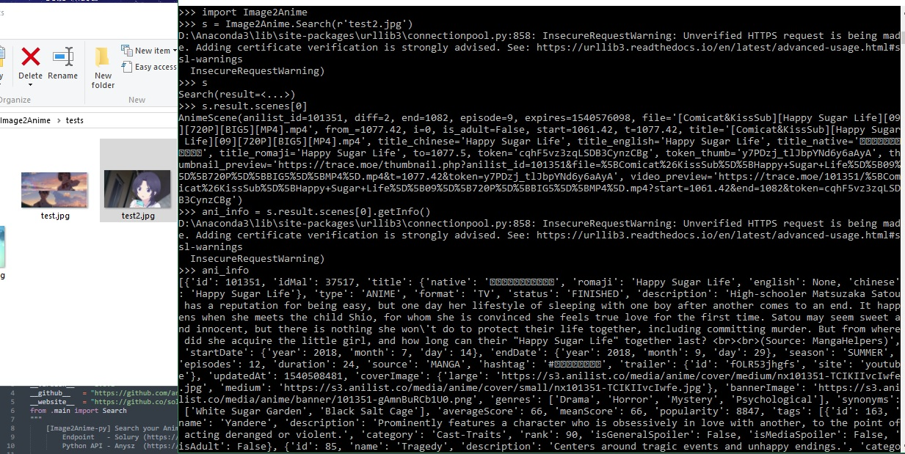

Image2Anime
----

  

Refrence
----

- Based : [Soruly's Repo](https://github.com/soruly/trace.moe)
- WEB   : [The web](https://trace.moe/)

***The Endpoint isn't mine, I just make the API***

Usage
----

 **First of all, you need to install the library**

     $ python setup.py install
    
 **First use**

     >>> import Image2Anime

 **To check your quota**
     >>> stat = Image2Anime.Me()
     >>> # If you have the token
     >>> stat = Image2Anime.Me('theTokenHere')

 **To start search the anime by local path**

     >>> res = Image2Anime.Search(r'/path/to/source')

 **To start search the anime by io text/buffer**

     >>> with open(r'/path/to/source', 'rb') as fp:
     ...... res = Image2Anime.Search(fp)

 **To start search the anime by raw image binary**

     >>> res = Image2Anime.Search(image_raw=b"the image binary here")

 **To start search the anime by url**

     >>> res = Image2Anime.Search(url="http://the_image_url_here")

 **To get the results**
 
     >>> print(res); print(res.result)

 **To get match scenes and get other information**

     >>> first_match = res.result.scenes[0]; other_information = first_match.getInfo(); duration = first_match.getDuration();
     >>> # Its example how to get result data - the getInfo and getDuration stored on memory so you only need to do once
     >>> print(first_match)

 **QnA**

     Q : Whats the first step?
     A : python setup.py install
     Q : Where's the example?
     A : At tests folder
     Q : Lib imported not found?
     A : pip install PACKAGENAME
     Q : Your issue not solved?
     A : Create new issue with what your problem and what you want to achieve :D

Screenshot
----------

Special Thanks
----
[Soruly](https://github.com/soruly)

Author
----

[Anysz](https://instagram.com/nugra.z) / [@Anysz](https://github.com/anysz)
